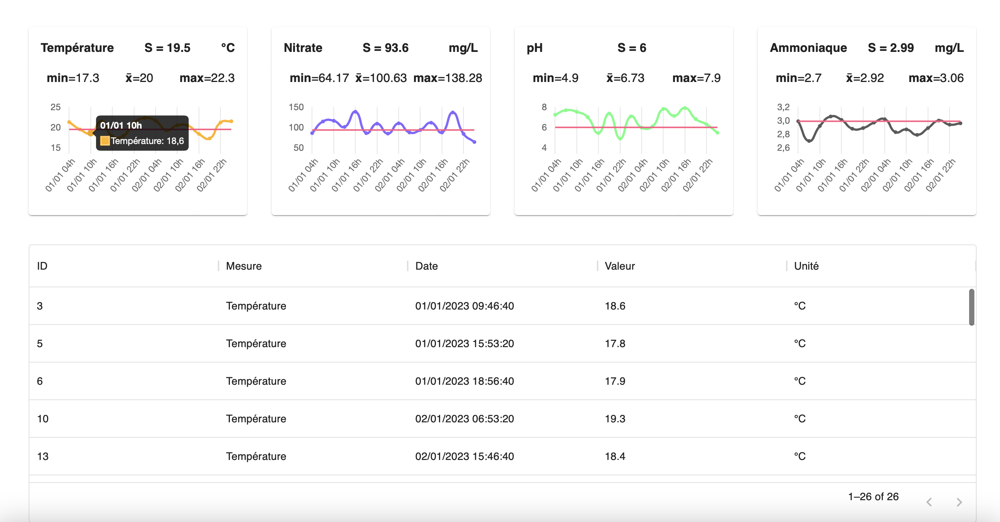

# Streamlit Datagrid

## Installation

Install the package with the following command :
```
pip3 install streamlit_datagrid
```
You can use Python>=3.6 and Streamlit to use this component.

## Definition

Given a dataframe with labeled sensors' records and a threshold for each sensor, Streamlit MUI/React Datagrid component displays every record where the measure value is out of the given threshold.

For example, given a temperature sensor, we want to display every record where the temperature is over 20°C : we have to specify the threshold dictionary as {"Temperature": {"value": 20, "side": ">"}} and the dataframe of records in Streamlit Datagrid component.

### v0.0.1

<div style='text-align: center;'>
    
    <p>Streamlit DataGrid example with Streamlit Line Chart</p>
</div>

## Arguments

| **Argument** | **Description**                                                                                                                                       | **Default value**   |
|--------------|-------------------------------------------------------------------------------------------------------------------------------------------------------|---------------------|
| df           | Dataframe where the displayed data come from.                                                                                                         | [REQUIRED VALUE]    |
| label        | Column label for label sensor record.                                                                                                                 | [REQUIRED VALUE]    |
| measure      | Column label for sensor measure record.                                                                                                               | [REQUIRED VALUE]    |
| th           | Threshold dictionary for every label contained in dataframe label column. Format : {\<label value\>: {"value": \<value\>, "side": \<operator\>}, ...} | [REQUIRED VALUE]    |
| headers      | List of headers names to display. Must be [] or a list of strings with equal length with dataframe.columns value.                                     | "rgb(0, 0, 255)"    |
| height       | Height value of the box containing the datagrid component.                                                                                            | None                |
| key          | Key of the component. Must be declare to avoid issue.                                                                                                 | None                |

## Notes

I may not update this component. I do this for personal purpose only. However, you can suggest ideas, if it doesn't take too much time I'll consider modifying this work.
